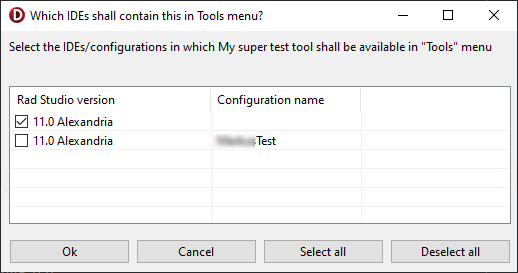

# AddIDETool
This project provides a unit you can use to manage entries in the IDE's tools menu.
With this unit you can check, if a certain tool in a certain path is already in the
tools menu and you can add or remove tools to or from that menu.

The check is performed for a single Rad Studio version you specify (there's a method 
to find all installed Rad Studio/Delphi versions) but adding and removing can be done for
a complete list of Rad Studio/Delphi versions.

It now even provides a nice VCL based dialog for selecting to which 
configurations/versions to add your application to the Tools menu or from which to 
remove it. It looks like this:

So if you write an IDE addon the unit might be an easy way to integrate that into 
the tools menu. I don't know whether there's an OTAPI api for doing so. If your
add-on wouldn't require to use the OTAPI IDE api for other purposes anyway, this unit
is most likely an easier way to add your add-on to that menu compared to learn how to
deal with the OTAPI api.

The project contains a small console application as demo for the unit, a GUI based demo 
for using the dialog and the unit includes XMLDOC commenting but it is easy to use anyway.

# Installation
No special steps required. Simply make sure the unit can be found in your project.

# Prerequisites
The unit should be useable from Delphi 2009 and newer.
